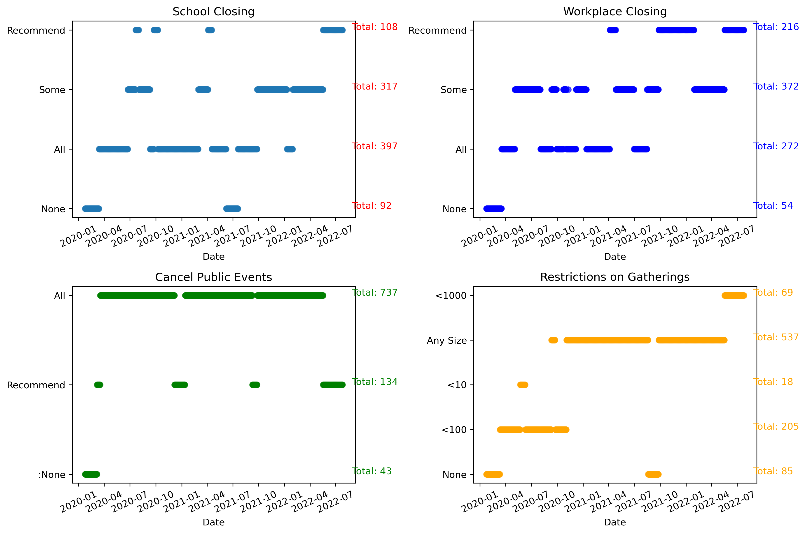
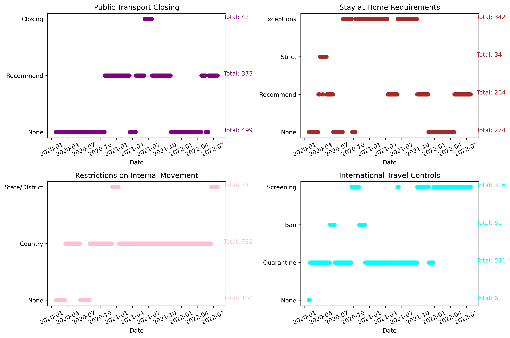
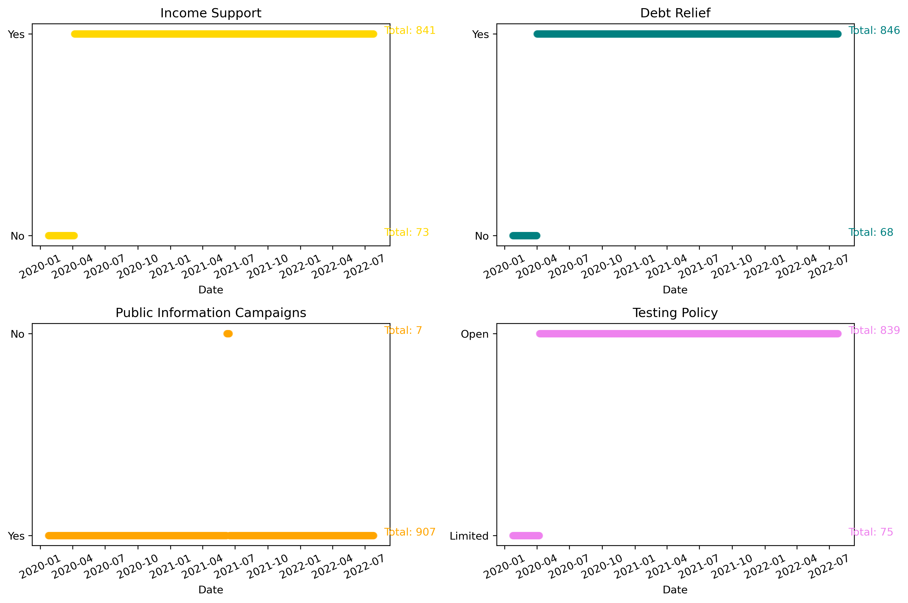
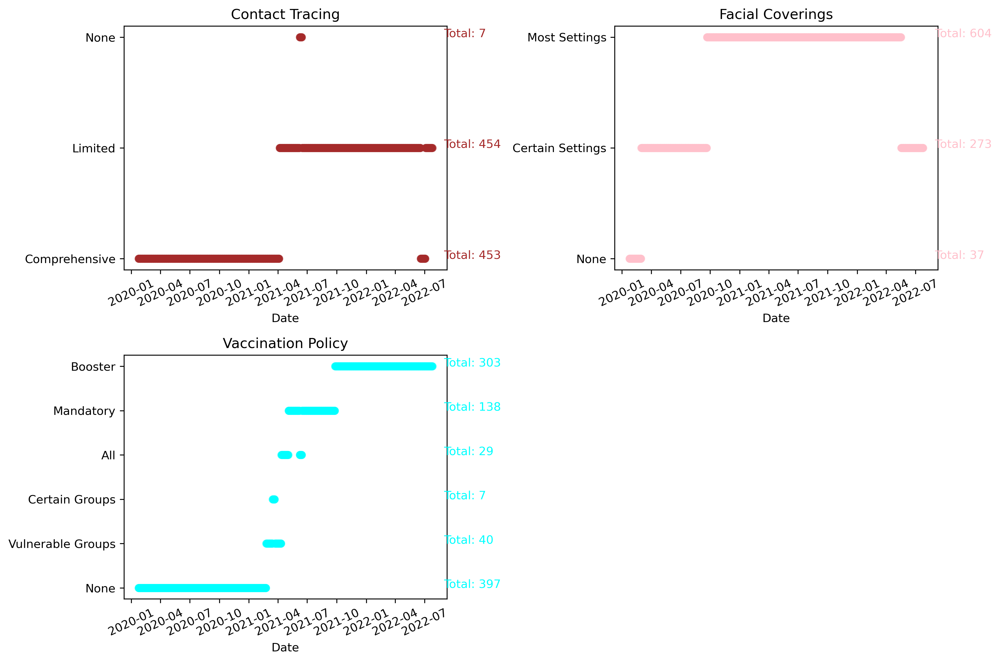
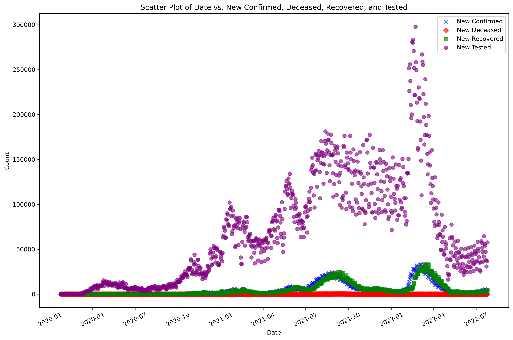
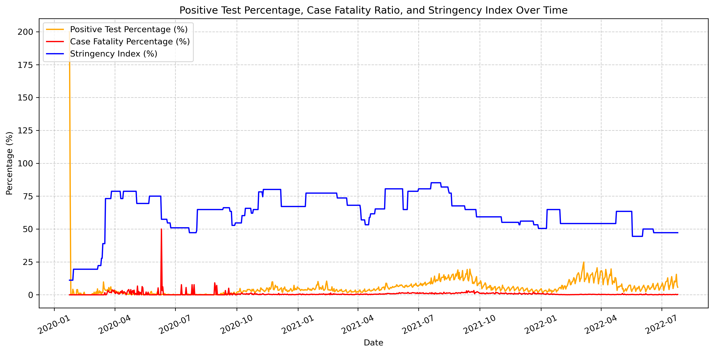

# 🦠 COVID-19: Analyzing Trends and Government Interventions in Malaysia

  

  
  
  

---

## 📊 Overview and Introduction

This data science project analyzes COVID-19 trends and public health interventions in **Malaysia** from 2020 to 2022. The project uses publicly available data from [Google COVID-19 Open Data](https://health.google.com/covid-19/open-data/raw-data?loc=MY) and leverages Python to perform data cleaning, transformation, and descriptive analysis.

The focus is to:
- Understand the spread of COVID-19 over time.
- Analyze the impact of government policies like lockdowns, school closures, and vaccination campaigns.

---

## 📁 Dataset Overview

Key data sources and features:

- 🧬 **COVID-19 Statistics**: New confirmed case, New deceased, New recovered, New tested, New persons fully vaccinated  
- 🏛 **Government Responses**: School closing, 
Workplace closing, 
Cancel public events, 
Restrictions on gatherings, 
Public transport closing, Stay at home requirements, 
Restrictions on internal movements, 
International travel control, 
Income support, 
Debt relief, 
Public information campaigns, 
Testing policy, 
Contract tracing, 
Facial coverings, 
Vaccinations policy, 
Stringency Index, 

- 📈 **Derived Metrics**: Positive Test % and Case Fatality %

---

## 🎯 Objectives

- To examine the trends in daily COVID-19 statistics, including new confirmed 
cases, recoveries, and deaths, to gain insights into the pandemic's progression 
over time. 
- To analyse how government interventions, such as school closures, travel 
restrictions, and vaccination policies, correlate with changes in COVID-19 
statistics. 

---

## 🧹 Data Cleaning & Preparation

Steps taken:
- ✔ Removed irrelevant and duplicate data
- ✔ Handled missing values (using 0 or row removal)
- ✔ Converted categorical policy variables for analysis
- ✔ Created new indicators like:
  - Positive Test % = New Confirmed / New Tested
  - Case Fatality % = New Deceased / New Confirmed

---

## 📈 Analysis & Visualizations

Visual insights include:

### 📌 Government Policy Timeline

> 
> 
> 
> 

Visualizes when policies (e.g., school closures, lockdowns) were implemented or lifted.

---

### 📌 Trends in Confirmed, Recovered, Tested

> 

Two major waves correspond to **Delta** (mid-2021) and **Omicron** (early 2022). Recoveries lag behind confirmed cases by a few days.

---

### 📌 Case Fatality vs. Vaccination & Stringency

> 

As vaccination rates rise, case fatality percentage falls — showing the vaccine’s role in reducing mortality.

---

## 🧩 Key Challenges

- ⚙️ High dimensional dataset (165 variables)
- 🧪 Handling missing data from changing policies
- 🔄 Converting binary/dummy policy values into descriptive categories
- 🎨 Managing visualization complexity for clarity

---

## ✅ Conclusion

- **Vaccination rollout** and **stringent policies** were effective in reducing fatality rates.
- **Positive test rate** dropped after mass testing and policy tightening.
- The **Stringency Index** correlates with containment success in key waves.
- This project underscores the value of **data-driven public health policy**.

---

## 🧠 Tools & Libraries Used

| Tool            | Purpose                        |
|-----------------|--------------------------------|
| `pandas`        | Data manipulation              |
| `numpy`         | Numerical operations           |
| `matplotlib`    | Visualization                  |
| `seaborn`       | Advanced plots                 |
| `jupyter`       | Notebook environment           |

---

## 🧑‍💻 Author

**Azrul Zulhilmi bin Ahmad Rosli**  
📘 STQD 6014 Data Science — Semester 1, 2024/2025  
👩‍🏫 Lecturer: Dr. Nurul Afiqah Burhanuddin

---

## 📚 References

- [Google COVID-19 Open Data](https://health.google.com/covid-19/open-data/raw-data?loc=MY)
- Free Malaysia Today (FMT), Ministry of Health Malaysia
- VanderPlas, J. (2016). *Python Data Science Handbook*
- McKinney, W. (2012). *Python for Data Analysis*
